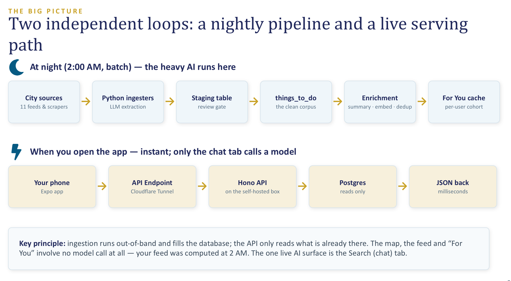

  
  <h1>Serendip</h1>
  
<b>Discover things to do in your city, and actually do them.</b>

Most people end up at the same few places. The options are out there, but finding them is work:
Eventbrite, Facebook events, a handful of local listings sites, none of them agreeing with each
other. Serendip collects what is on in a city, puts it on a map you can act on in a few taps,
learns what you like, and lets you just ask for whatever you are in the mood for.

I built all of it: the phone app, the API, the database and the nightly pipeline.

## Demo

  <!-- Wrapped in its own anchor on purpose: GitHub linkifies bare markdown images to the
       file's blob page, which navigates away from the README. Its own <a> suppresses that,
       and pointing it at this section's heading keeps a click on the page. -->
  

<i>One take, real time, on a Samsung A05s. Browsing suggestions on the map,
saving one, filtering to free events, then asking the Search tab a question in plain English. 
<a href="media/demo.mp4">Full quality recording</a></i>

## A closer look

| Map | Event | Search |
|---|---|---|
|  |  |  |
| Everything on in the city, clustered with suggestions | Details, with a one line summary an LLM wrote from the source page | Ask in plain English. The answers are real events, with suggested follow ups |

## How it's built

Two loops that stay out of each other's way. A nightly pipeline pulls from about a dozen city
sources, uses an LLM to turn messy event pages into structured rows, drops the duplicates that show
up when two sources list the same thing, and works out each user's feed in advance from what they
liked when they signed up and what they have saved since.

When you open the app, the API only reads what is already sitting in Postgres, so the map and the feed cost no
model call at all. The Search tab is the one place a model runs while you wait.

The models run on a GPU box, which also hosts the API and the nightly job. That was
a deliberate choice while prototyping: running inference on my own hardware costs nothing.
