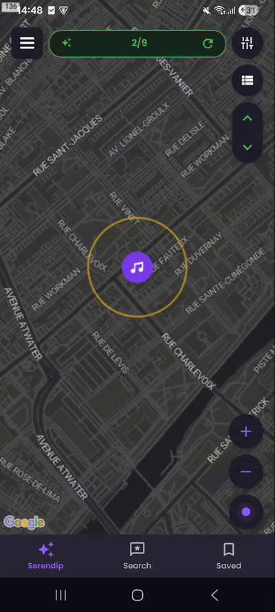
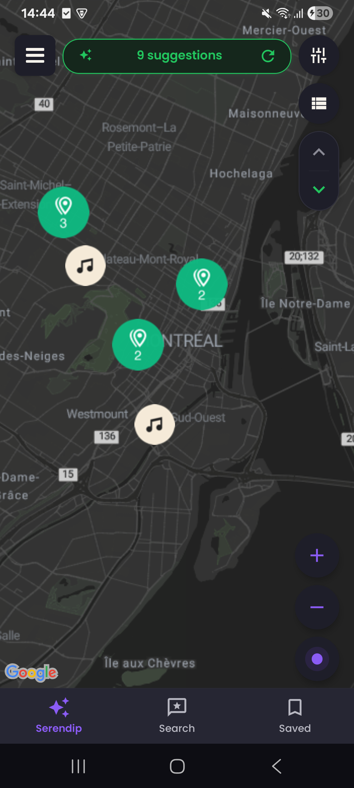
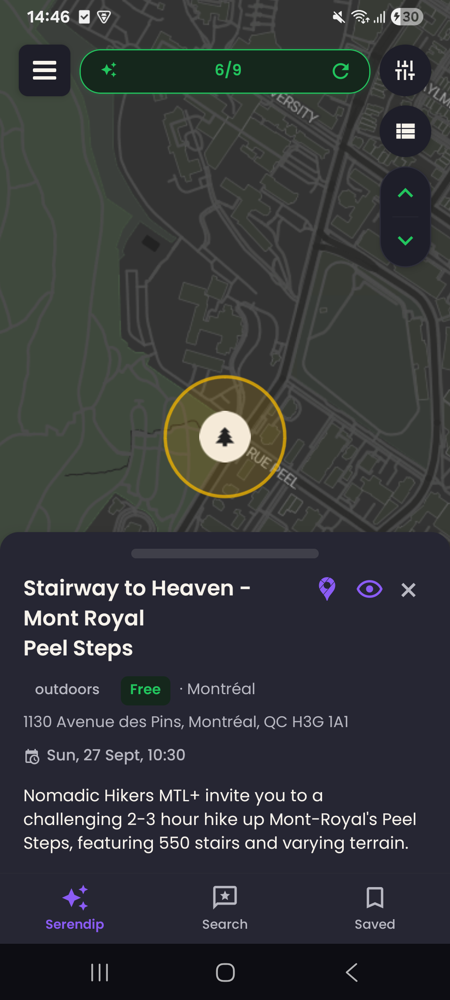
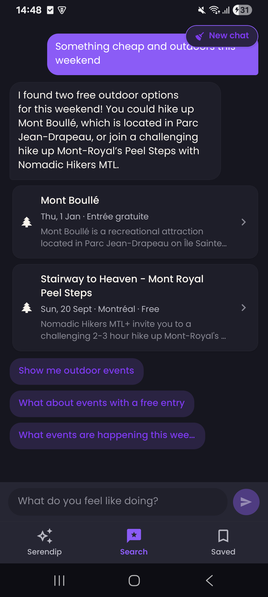
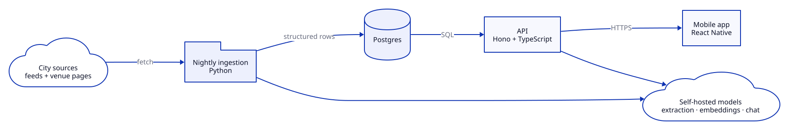

  
  <h1>Serendip</h1>
  
<b>Discover things to do in your city — and actually do them.</b>

Most people default to the same five places, not because options don't exist but because finding
them is exhausting — Eventbrite, Facebook events, four local listings sites, none of them agreeing.
Serendip pulls what's on in a city into one place and puts it on a map you can act on in a few
taps. Built solo, end to end: mobile app, API, database, and a nightly pipeline that reads event
pages with an LLM and turns them into structured rows.

Montréal, on a real phone, against real data.

## Demo

*One take, real-time, on a Samsung A05s: browsing suggestions on the map, saving one, filtering to
free events, then asking the Search tab a question in plain English.
([full-quality recording](media/demo.mp4))*

## A closer look

| Map | Event | Search |
|---|---|---|
|  |  |  |
| Everything on in the city, clustered | Details, with a one-line summary written by an LLM from the source page | Ask in plain English; answers are grounded in real events, with follow-ups |

## How it's built

A React Native app talks to a TypeScript API over Postgres. A nightly Python pipeline pulls from
around a dozen city sources — some with clean feeds, most without — and uses an LLM to turn messy
event pages into structured rows, then deduplicates what the sources publish twice. Recommendations
run on embedding search over that corpus, and the Search tab is a chat over the same data.

The models are self-hosted on my own GPU box, which also runs the API and the nightly job; the app
reaches it through an outbound-only tunnel. It ships to real phones through TestFlight and Google
Play internal testing.

## Status

Parked since August 2026. The product question it was built to answer got a yes — I used it to do
things I wouldn't otherwise have done — but the consumer space got crowded and the business model I
tried next didn't survive contact with real customers. Stopping there was the cheap outcome.

It still runs on my phone.
